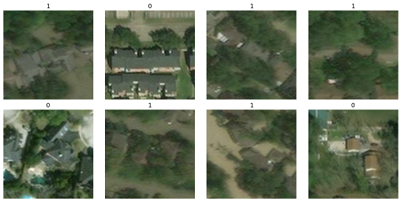
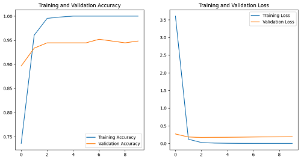

# Hurricane Damage Detector

 

#### -- Project Status: [Completed]

## Project Intro/Objective
The purpose of this project is to build a classifier which can identify if a specific region (based on the satellite images) has suffered from flooding and other typical structural damages due to hurricane.

### Method Used
* Image Processing
* Machine Learning
* Deep Learning

### Technologies
* TensorFlow
* Keras
* Python
* Scikit-learn
* Matplotlib
* Google Colab

## Project Description
This project works on an open dataset consisting of satellite imagery data to detect damaged buildings due to a hurricane. These satellite images are taken from the aftermath of Hurricane Harvey in 2017. The aim is to build a classifier which can identify if a specific region (based on the input satellite image) is likely to have suffered from flooding and other typical structural damages due to Hurricane Harvey. The dataset has been taken from IEEE Dataport and modified to build a balanced dataset of satellite images which either signify the present of damaged buildings or buildings with no damage. The focus is to build a binary classifier to classify images as "damage" or "no_damage" by using a combination of Convolutional Neural Network (CNN) and transfer learning. Two pre-trained models are used, VGG19 and ResNet50. They are both pre-trained using the ImageNet dataset, a large dataset consisting of more than one million images and one thousand classes with a wide variety of categories like "dogs" and "fruits". The use of these pre-trained models helps to improve the classification accuracy of the satellite images in the test data (the images that have been excluded when training the model) to 94%.
